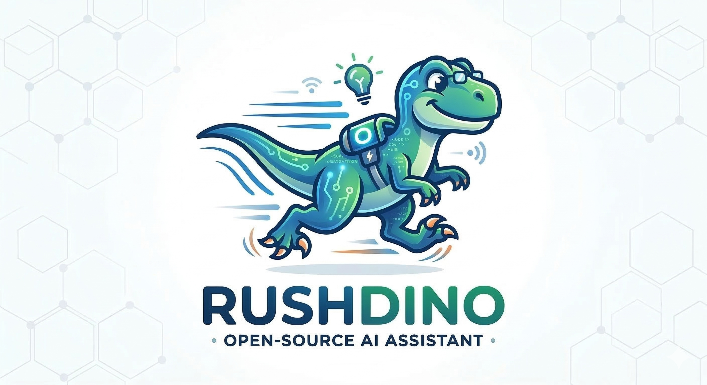

# RushDino

  

RushDino is an **open-source local AI assistant platform** written in Rust, designed to run powerful agents on your own machine with fast, privacy‑preserving workflows. It focuses on being **developer-friendly, extensible, and easy to integrate** into your existing tools and automation.

## Product Docs

- [Vision](./VISION.md)
- [Security](./SECURITY.md)
- [Architecture](./ARCHITECTURE.md)
- [Detailed system architecture](./docs/system-architecture.md)
- [Installation & Deployment](./docs/deployment-guide.md)

## Quickstart (from source)

1. Install Rust stable + Node.js 22+
2. Build frontend and backend:
   - `./scripts/install.sh`
3. Initialize config:
   - `rushdino init`
4. Start server in foreground:
   - `rushdino start`
5. Open [http://localhost:28847](http://localhost:28847)

## CLI

- `rushdino init`
- `rushdino start`
- `rushdino stop`
- `rushdino restart`
- `rushdino status`
- `rushdino upgrade`

## License

MIT
