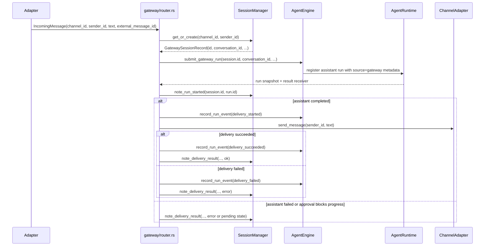

# Runtime Flows

## 1. HTTP chat flow (`POST /api/chat`)

```mermaid
sequenceDiagram
  participant Client
  participant Route as routes/chat.rs
  participant Gate as ApprovalGate
  participant Engine as AgentEngine
  participant Runtime as AgentRuntime
  participant Loop as react_loop
  participant Tools as ToolRegistry
  participant DB as Conversation Store

  Client->>Route: POST /api/chat
  Route->>Route: size + prompt-injection checks
  Route->>Gate: register_session(ephemeral)
  Route->>Engine: submit_http_run(...)
  Engine->>Runtime: register assistant run + session lane
  Engine->>DB: load/create conversation
  Engine->>Loop: run_react_loop
  Loop->>Tools: execute tool calls
  alt dangerous shell_exec
    Tools->>Gate: request_approval
    Gate->>Runtime: mark awaiting_approval + policy snapshot
    Route-->>Client: status=pending_approval
  else normal path
    Engine->>DB: persist assistant/tool messages
    Engine->>Runtime: persist completed run snapshot + events
    Route-->>Client: status=completed
  end
```

Key files:
- `crates/server/src/routes/chat.rs`
- `crates/server/src/approval_gate.rs`
- `crates/agent/src/engine.rs`
- `crates/agent/src/react_loop.rs`

## 2. WebSocket chat flow (`GET /api/ws/chat`)

- WS handler creates a session id and registers it with `ApprovalGate`.
- Incoming message is parsed as either JSON `{ conversation_id, message }` or raw text.
- Engine submits the turn into the runtime and streams events from the active run.
- Outbound event types include:
- `chat_chunk`
- `assistant_reset`
- `tool_start`
- `tool_end`
- `approval_request`
- `approval_result`
- `error`
- Stream events now also carry `run_id` so the UI can deep-link into `/api/runs/:id`.

Key file: `crates/server/src/ws.rs`

## 3. Channel gateway flow (Telegram/Discord/Slack/WebChat)



Behavior notes:
- Session key is `(channel_id, sender_id)` in `gateway_sessions`.
- Runtime lane key is `gateway_session.id`; assistant conversation key remains `gateway_session.conversation_id`.
- Gateway-originated runs persist `source`, `channel_id`, `sender_id`, and `gateway_session_id` in `runtime_runs`.
- Router dispatch is bounded by a global semaphore so inbound channel traffic cannot grow unbounded task fan-out.
- Duplicate inbound events are suppressed in-memory for a short window when the adapter provides `external_message_id`.
- Delivery is queued per adapter and executed by gateway-owned workers with fixed per-channel rate limiting, bounded retry/backoff, and terminal failure recording.
- Gateway outbound delivery now uses a structured message envelope with `fallback_text` plus portable rich blocks (formatted text, code blocks, link lists, image URLs, link-button groups).
- Adapters publish capability flags (`plain_text`, `markdown`, `code_blocks`, `images`, `link_buttons`) and render the structured envelope with safe degradation when a channel cannot carry a richer block.
- Delivery lifecycle is tracked as runtime events so the UI can inspect send failures without reading adapter logs.
- Adapter restart is exposed as `POST /api/gateway/adapters/:channel/restart` through the gateway control plane, not through CLI-only recovery commands.
- Session reset is now exposed as `POST /api/gateway/sessions/:id/reset`; the next inbound message creates a fresh conversation mapping.
- Dangerous tool approvals from gateway-originated runs flow through the same approval queue and run state model as HTTP and WebSocket runs.

Key files:
- `crates/gateway/src/gateway.rs`
- `crates/gateway/src/router.rs`
- `crates/gateway/src/delivery.rs`
- `crates/gateway/src/dedupe.rs`
- `crates/gateway/src/session.rs`
- `crates/gateway/src/adapter.rs`
- `crates/server/src/routes/gateway.rs`

## 4. Tool execution flow

- Tools are defined by `Tool` trait and registered in `build_engine_deps`.
- ReAct loop appends assistant tool calls, executes tools concurrently, then appends tool outputs as `Role::Tool` messages.
- Tool argument taint scanning can block malicious input before execution.
- `shell_exec` now forwards `run_id` into the server broker so approval outcomes and policy metadata are persisted against the owning run.

Key files:
- `crates/agent/src/tool_registry.rs`
- `crates/agent/src/engine_bootstrap.rs`
- `crates/agent/src/react_loop.rs`
- `crates/security/src/validation.rs`

## 5. Runtime API flow (`/api/runs*`)

- `POST /api/runs` creates a new assistant run without inventing a second control path outside the runtime.
- `GET /api/runs` and `GET /api/runs/:id` read persisted snapshots from `runtime_runs` and `runtime_run_events`.
- `POST /api/runs/:id/abort` marks queued/running/approval-pending work aborted and resolves any pending approval for that run.
- `GET /api/runs/:id/wait` long-polls the persisted run snapshot until it reaches either a wait-target state or the timeout.

## 6. Desktop flow (GPUI desktop client)

- `backend_process` starts the bundled `rushdino-server` helper on an
  available loopback port with a per-launch HMAC secret.
- `store` verifies `/healthz`, loads resource views through signed
  HTTP requests, and streams chat through `/api/ws/chat`.
- The owned helper process is terminated when the app exits.

Key files:
- `crates/desktop-app/src/backend_process.rs`
- `crates/desktop-app/src/api_client.rs`
- `crates/desktop-app/src/chat_socket.rs`
- `crates/desktop-app/src/store.rs`

Last verified: 2026-08-22
