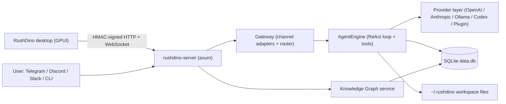

# System Overview

## Backend architecture

- Server bootstrap and routes: `crates/server/src/lib.rs`
- HTTP + WS entrypoints: `crates/server/src/routes/*`, `crates/server/src/ws.rs`
- Channel abstraction + routing: `crates/gateway/src/*`
- Core agent runtime: `crates/agent/src/engine.rs`, `crates/agent/src/react_loop.rs`
- Tool registration/wiring: `crates/agent/src/engine_bootstrap.rs`
- Shared config/credentials/init: `crates/common/src/*`

## GPUI desktop client

- App entry: `crates/desktop-app/src/main.rs`
- UI views: `crates/desktop-app/src/ui/`
- HTTP client and HMAC signing: `crates/desktop-app/src/api_client.rs`, `crates/desktop-app/src/signer.rs`
- Streaming chat: `crates/desktop-app/src/chat_socket.rs`

## Desktop architecture

- Backend helper lifecycle: `crates/desktop-app/src/backend_process.rs`
- The app bundles `rushdino-server`, starts it on an available loopback port,
  and uses the same `~/.rushdino` data as the CLI.

## Persistence and workspace

- SQLite (primary runtime state): conversations, sessions, workflows, logs, usage, graph
- `~/.rushdino` filesystem state:
- Identity/bootstrap docs (`SOUL.md`, `AGENTS.md`, etc.)
- `memory/` for persistent memory files
- `agents/*.toml` and `skills/*.toml`
- `config.toml` and `credentials.toml`

## Provider and auth layer

- Provider resolution and runtime refresh: `crates/server/src/lib.rs`, `crates/server/src/routes/providers.rs`
- Auth methods include API key, OAuth, and none (via profile config in common/auth crates).

Last verified: 2026-08-22
